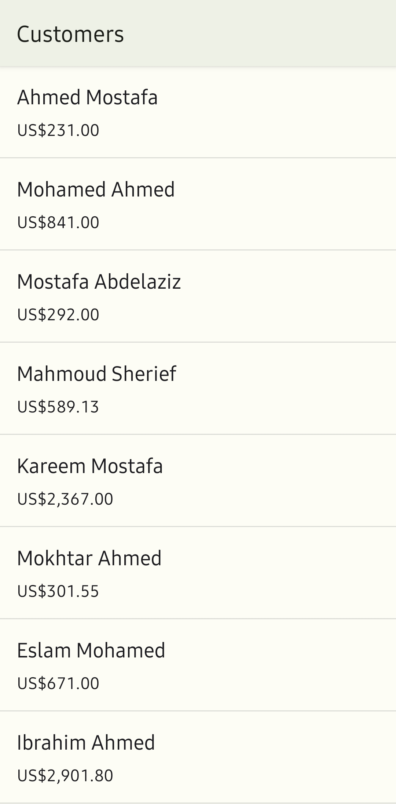
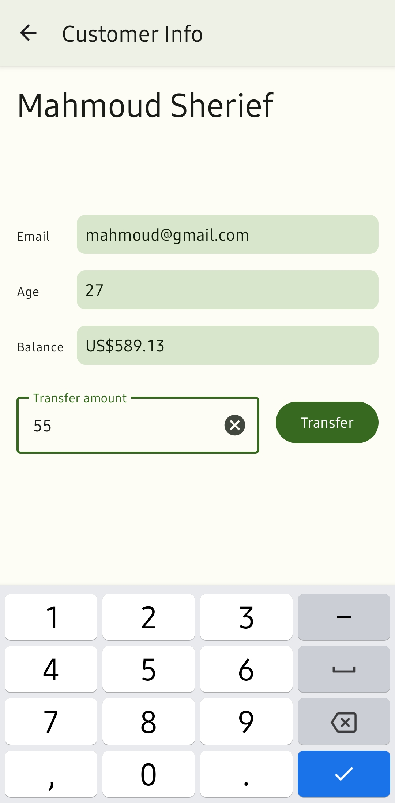
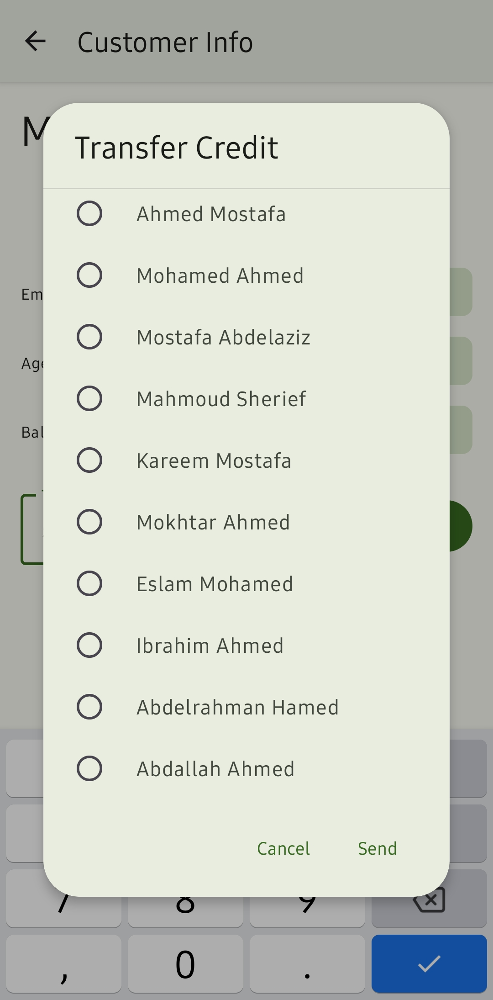
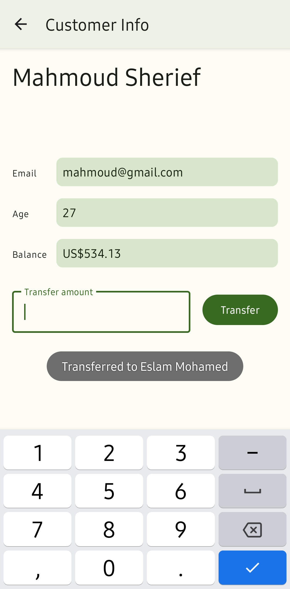

# BankTransfer

Simple master-detail application as part of the Graduate Rotational Internship Program from The Sparks Foundation.

Home             |  Detail             |  Transfer             |  Finished
:-------------------------:|:-------------------------:|:-------------------------:|:-------------------------:
  | | |

A user can view account balances and transfer specified amounts between accounts.

Topics:
- Room database
- RecyclerView
- Data Binding
